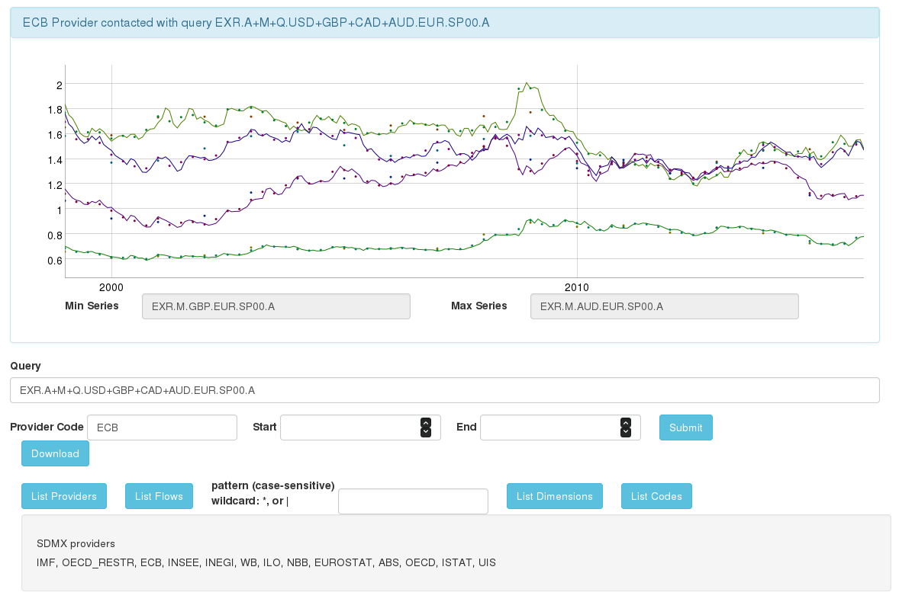

SDMX Play application
=================================

Scala Play application using [SDMX](https://github.com/amattioc/SDMX) Java functions and [dygraphs](https://github.com/danvk/dygraphs) timeseries visualization.

This application retrieves time series available from SDMX APIs. The SDMX query can either be specified through the user interface or by modification of the URL. The SDMX provider is henceforth contacted with the query and in case of existing time series returns information transformed into a JavaScript data format for display and download.

To facilitate defining the query, available dimension members can be displayed for the selected flow and provider.

## Example Queries

- [Daily Exchange Rates USD, GBP to EUR since 2010](https://boiling-lake-45550.herokuapp.com/ECB/EXR.D.USD+GBP.EUR.SP00.A/?start=2010)

